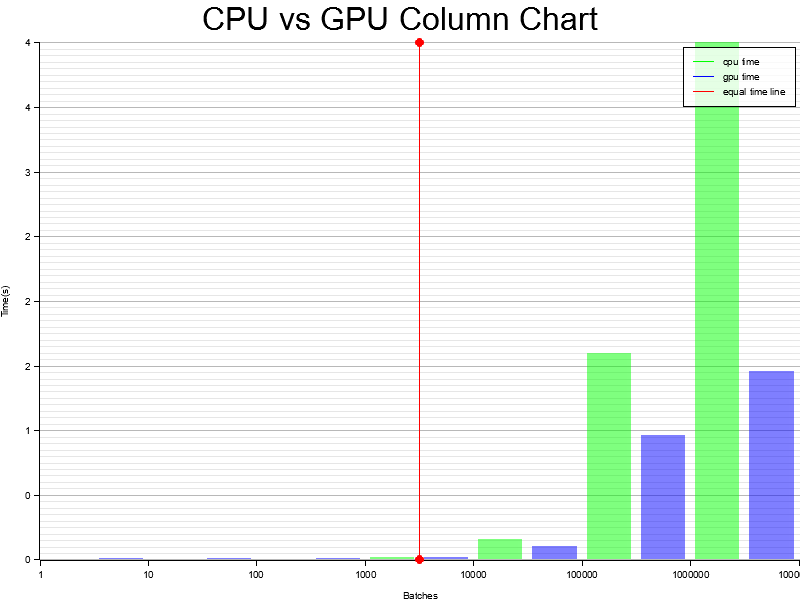

# Information about executing the program

## Input data

Points and scalars are stored in the `Data` folder in `points.hex` and `scalars.hex` files. All numbers are stored in hex format.

## How to run a program

To execute the GPU algorithm type command `cargo run --release (batch number)`.
`Batch number` is a number of operations in the `msmRun` function. This number can be set as an environment variable.
If the environment variable is not set, the default number of batch operations will be used.
The default number if 1000.

## How to run tests

To execute tests of the WGSL functions type command `cargo test --test wgsl_tests`.

To execute tests of the cpu curve functions type command `cargo test --test cpu_tests`.

To execute integration tests type command `cargo test --test integration_tests`.

To execute benchmark tests type command `cargo bench`.

## GPU information

| Parameter | Value |
| :--- | :--- |
| name    | "NVIDIA GeForce GTX 1660 Ti"    |
| vendor    | 4318    |
| device    | 8578    |
| device_type    | DiscreteGpu    |
| driver    | "NVIDIA"    |
| driver_info    | "536.25"    |
| backend    | Vulkan    |

## Results of benchmark tests

Curve functions (single operation)

| Function name | CPU time (ns) | GPU time (µs) |
| :--- | :---: | :---: |
| setZero    | 1.3038    | 3.4952    |
| setOne    | 1.7842    | 3.4982    |
| setR    | 1.2993    | 3.5546    |
| set    | 1.8526    | 3.4793    |
| load    | 3.2898    | 3.5847    |
| store    | 4.2004    | 3.5337    |
| isZero    | 2.0706    | 3.5247    |
| addN    | 6.9315    | 3.7984    |
| add    | 15.173    | 3.4795    |
| sub    | 8.1715    | 3.5510    |
| mul    | 161.10    | 3.4774    |
| swap    | 2.2050    | 3.4966    |
| reduce    | 7.9126    | 3.4972    |
| reduce_PointXYZZ    | 19.197    | 3.7885    |
| load_PointXYZZ    | 32.026    | 3.4905    |
| store_PointXYZZ    | 24.032    | 3.4648    |
| normalize_PointXYZZ    | 17.314    | 3.4401    |
| setZero_AccumulatorXYZZ    | 1.2916    | 3.4805    |
| dbl_AccumulatorXYZZ    | 16.923    | 3.5512    |
| add_AccumulatorXYZZ    | 20.525    | 3.4924    |

Curve functions (batch operations)

| Function name | CPU time (µs) | GPU time (µs) |
| :--- | :---: | :---: |
| setZero    | 689.10    | 10.045    |
| setOne    | 686.30    | 9.9289    |
| setR    | 688.86    | 9.9289    |
| set    | 693.75    | 10.082    |
| load    | 683.11    | 10.274    |
| store    | 697.40    | 10.029    |
| isZero    | 685.00    | 10.119    |
| addN    | 884.01    | 10.381    |
| add    | 1030.5    | 10.804    |
| sub    | 958.00    | 9.9574    |
| mul    | 2570.1    | 9.9935    |
| swap    | 725.68    | 10.026    |
| reduce    | 930.66    | 9.9470    |
| reduce_PointXYZZ    | 3244.3    | 10.157    |
| load_PointXYZZ    | 3325.6    | 10.146    |
| store_PointXYZZ    | 3321.1    | 11.058    |
| normalize_PointXYZZ    | 18514    | 11.058    |
| setZero_AccumulatorXYZZ    | 2459.1    | 10.206    |
| dbl_AccumulatorXYZZ    | 3286.3   | 10.649    |
| add_AccumulatorXYZZ    | 3143.8    | 10.321    |

MSM functions (single operation)

| Function name |  Cuda version (s) |  Wgsl version (s) | CPU version (s)
| :--- | :---: | :---: | :---: |
| msmPreprocessPoints    | 1.0581    | 0.44464    | 0.11372    |
| msmRun    | 3.5291    | 0.0079639    | 0.000014457    |

MSM functions (batch operation)

| Function name |  Wgsl version (s) | CPU version (s)
| :--- | :---: | :---: |
| msmPreprocessPoints (10000)    | 2.9130    | 44.792 s    |
| msmRun (10)   | 0.0083614    | 0.00015908    |
| msmRun (100)   | 0.0094583    | 0.0015473   |
| msmRun (1000)   | 0.018779    | 0.016325    |
| msmRun (10000)   | 0.10669    | 0.16090    |
| msmRun (100000)   | 0.96376    | 1.5984    |
| msmRun (1000000)   | 1.4567    | 15.929    |

## Graph of execution time versus number of operations

