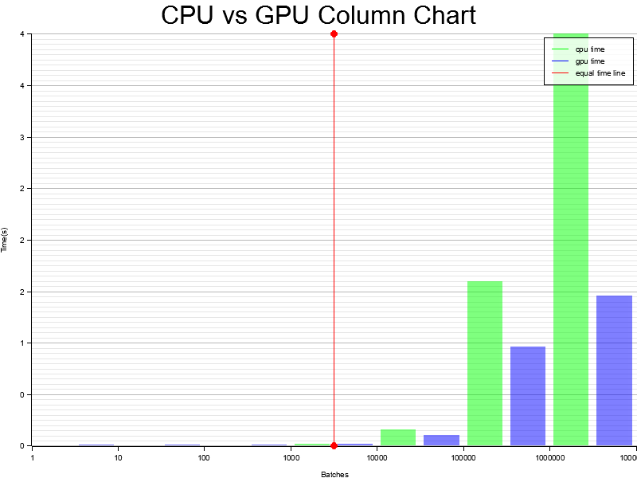
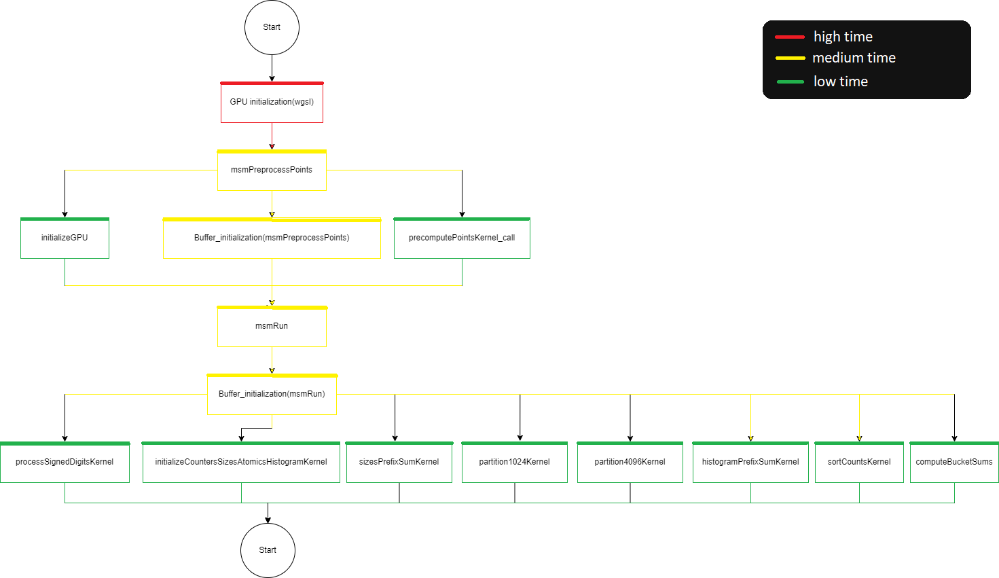

# Information about executing the program

## Input data

Points and scalars are stored in the `Data` folder in `points.hex` and `scalars.hex` files. All numbers are stored in hex format.

## How to run a program

To execute the GPU algorithm type command `cargo run --release (batch number)`.
`Batch number` is a number of operations in the `msmRun` function. This number can be set as an environment variable.
If the environment variable is not set, the default number of batch operations will be used.
The default number if 1000.

## How to run tests

To execute tests of the WGSL functions type command `cargo test --test wgsl_tests`.

To execute tests of the cpu curve functions type command `cargo test --test cpu_tests`.

To execute integration tests type command `cargo test --test integration_tests`.

To execute benchmark tests type command `cargo bench`.

## GPU information

| Parameter | Value |
| :--- | :--- |
| name    | "NVIDIA GeForce GTX 1660 Ti"    |
| vendor    | 4318    |
| device    | 8578    |
| device_type    | DiscreteGpu    |
| driver    | "NVIDIA"    |
| driver_info    | "536.25"    |
| backend    | Vulkan    |

## Results of benchmark tests

Curve functions (single operation)

| Function name | CPU time (ns) | GPU time (ns) |
| :--- | :---: | :---: |
| setZero    | 1.3038    | 706.01    |
| setOne    | 1.7842    | 700.25    |
| setR    | 1.2993    | 719.06    |
| set    | 1.8526    | 711.66    |
| load    | 3.2898    | 707.60    |
| store    | 4.2004    | 710.92    |
| isZero    | 2.0706    | 715.38    |
| addN    | 6.9315    | 717.95    |
| add    | 15.173    | 713.15    |
| sub    | 8.1715    | 707.18    |
| mul    | 161.10    | 705.92    |
| swap    | 2.2050    | 705.73    |
| reduce    | 7.9126    | 711.71    |
| reduce_PointXYZZ    | 19.197    | 735.07    |
| load_PointXYZZ    | 32.026    | 721.74    |
| store_PointXYZZ    | 24.032    | 729.28    |
| normalize_PointXYZZ    | 17.314    | 725.76    |
| setZero_AccumulatorXYZZ    | 1.2916    | 718.31    |
| dbl_AccumulatorXYZZ    | 16.923    | 718.60    |
| add_AccumulatorXYZZ    | 20.525    | 717.94    |

Curve functions (batch operations)

| Function name | CPU time (µs) | GPU time (µs) |
| :--- | :---: | :---: |
| setZero    | 689.10    | 6.0390    |
| setOne    | 686.30    | 5.7381    |
| setR    | 688.86    | 6.0126    |
| set    | 693.75    | 8.1373    |
| load    | 683.11    | 8.0431    |
| store    | 697.40    | 6.5918    |
| isZero    | 685.00    | 6.1629    |
| addN    | 884.01    | 6.9120    |
| add    | 1030.5    | 7.8628    |
| sub    | 958.00    | 7.0503    |
| mul    | 2570.1    | 6.1058    |
| swap    | 725.68    | 7.7976    |
| reduce    | 930.66    | 5.9674    |
| reduce_PointXYZZ    | 3244.3    | 8.2567    |
| load_PointXYZZ    | 3325.6    | 7.4605    |
| store_PointXYZZ    | 3321.1    | 6.8488    |
| normalize_PointXYZZ    | 18514    | 6.1716    |
| setZero_AccumulatorXYZZ    | 2459.1    | 6.0214    |
| dbl_AccumulatorXYZZ    | 3286.3   | 6.4043    |
| add_AccumulatorXYZZ    | 3143.8    | 7.8699    |

MSM functions (single operation)

| Function name |  Cuda version (s) |  Wgsl version (s) | CPU version (s)
| :--- | :---: | :---: | :---: |
| msmPreprocessPoints    | 1.0581    | 0.44464    | 0.11372    |
| msmRun    | 3.5291    | 0.006636157     | 0.000014457    |

MSM functions (batch operation)

| Function name |  Wgsl version (s) | CPU version (s)
| :--- | :---: | :---: |
| msmPreprocessPoints (10000)    | 0.499887376    | 44.792    |
| msmRun (10)   | 0.007005054    | 0.00015908    |
| msmRun (100)   | 0.020280721    | 0.0015473   |
| msmRun (1000)   | 0.095563153    | 0.016325    |
| msmRun (10000)   |  0.116340438   | 0.16090    |
| msmRun (100000)   | 0.265482635   | 1.5984    |
| msmRun (1000000)   | 0.291771359    | 15.929    |

## Graph of execution time versus number of operations

## Function dependency diagram

